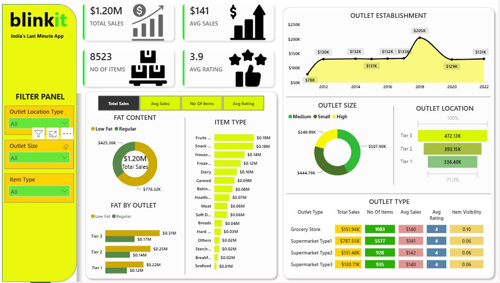

# 🛒 Blinkit Sales Analysis — Power BI

## 📌 Project Overview

An interactive Power BI dashboard analyzing Blinkit's sales performance across product categories, outlet types, outlet locations, outlet sizes, and fat content.

## 🛠️ Tools

- Power BI
- Excel / CSV
- Data Cleaning
- Data Visualization

## 📊 Key KPIs

| KPI | Value |
|---|---:|
| Total Sales | $1.20M |
| Average Sales | $141 |
| No. of Items | 8,523 |
| Average Rating | 3.9 |

## 🔍 Key Insights

- **Supermarket Type1** generated the highest sales at approximately **$787.55K**.
- **Tier 3 outlets** generated the highest location-level sales at approximately **$472.13K**.
- **Medium-sized outlets** contributed the highest sales at approximately **$507.90K**.
- **Fruits & Vegetables** and **Snack Foods** were among the highest-selling categories.
- **Low Fat** products generated the largest share of sales.

## 📈 Power BI Dashboard

## 💡 Business Recommendations

- Prioritize high-performing **Supermarket Type1** outlets.
- Focus inventory and promotions on high-performing product categories.
- Explore the strong performance of **Tier 3 markets** for future expansion.
- Optimize the product mix based on sales performance.

## 📁 Files

- `blinkit_data.csv` — Source dataset
- `BlinkIT_PBI.JPG` — Power BI dashboard
- `BlinkIT_Sales_Analysis.pbix` — Power BI project file
